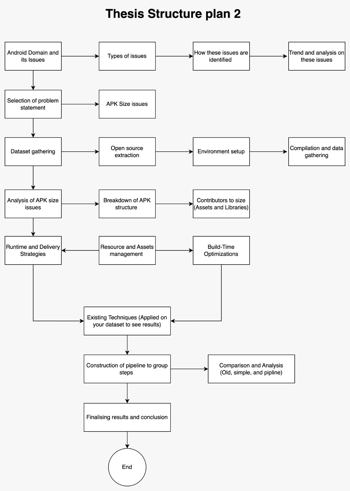

# Library Optimization in Android Development: A Comprehensive Study on APK Size

## Proposed Big picture

This is the proposed big picture of the current progress and overall idea. This covers all aspects to make the thesis document.

## Resource management 
Content with references for resource management portion for thesis is mentioned [**here**](./resource-managment/resourceManagment.md) and their respective sources [**here**](./resource-managment/raw/rawPapers.md)

### Research papers

- APK size optimisation and its tools are mentioned [**here**](./papers/ResearchPapers.md) and their respective [**findings**](./papers/findings)
- Papers regarding recommendations are mentioned [**here**](./recommendation/papers/researchPapers.md) and their respective [**findings**](./recommendation/papers/findings)

### Scripts and Outputs

- Script for compiling and extracting data from an APK is placed [**here**](./tools/scripts/main.py) and its sample
  [**output**](./tools/scripts/filtered_apk_data.csv)
- Script for extracting dependency tree for an application is placed [**here**](./recommendation/script/repoAnalysis/main.py) and its 
sample [**output**](./recommendation/script/repoAnalysis/dependency_tree.csv)
- Script for extracting repository links from github can be found [**here**](/recommendation/script/RepoLinkExtraction/extractRepos.py) and its
  [**output**](/recommendation/script/RepoLinkExtraction/github_links.csv)

### Filtered Applications flow  [**here**](/recommendation/script/filteredApplication/filtered.md)

### Dependency Extraction flow  [**here**](/recommendation/script/dependencyParsing/dependencyExtraction.md)

## Thesis 2 Plan

Thesis 1 is complete now to proceed with thesis 2, and incorporating feedback from thesis 1. 

### Thesis 1 feedback
- No such research on pre idea step, mainly there is no research done on how we came to select our topic
- No work or research has been done on resource management

### Thesis 2 Plan (revised)
- Do work on pre-topic research, and extract issues work
  - Find papers with android terms related to optimisation
  - Find issues in github, stack overflow and playstore reviews
  - Make a list of issues and then we select an issue matching one regarding to APK analysis
  - And compile the work and then compile it into the thesis report
- Work on resource management
  - Find papers on resource management optimisation
  - Alter script to show contribution share of resources in an APK vs the other files
  - Run individual approaches and see their impact on APK size
  - Make a chaining pipeline and run to see if there is an improvement 
- Compile all above steps to existing documents for final thesis report