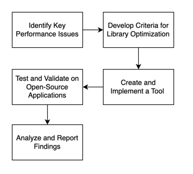
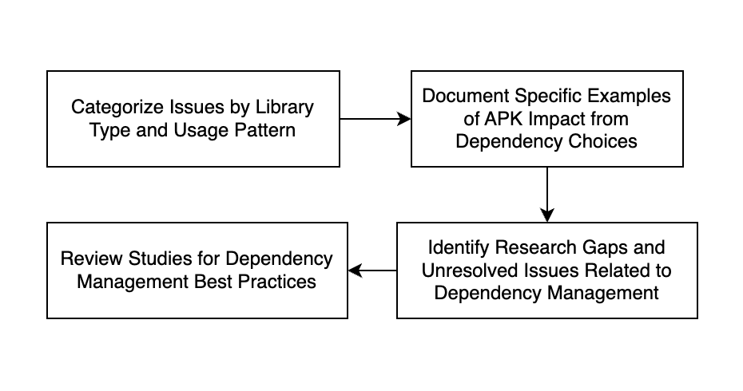
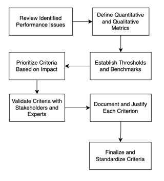

## Main Flow diagram

The complete picture as it stands, we step into each step with research paper and back each step with references  

### 1st phase: 

Steps possibly identified in the 1st phase **Key Performance Issues**, we extract papers that target that have 
keywords of performance issues, optimisation, android, dependencies optimisation, APK size, memory consumption, CPU usage, battery efficiency and if other keywords also fit

### 2nd phase: 

Once we have the issues identified and narrowed down from the 1st phase we will then proceed to extract bulk libraries dataset
and dig into research regarding specific optimisation on Dependencies optimisation, once we have things narrowed down, we will need to establish thresholds and benchmarks 
that we can base our analysis on. We will use existing tools found and mentioned to make these benchmarks mentioned here
[Tools](https://github.com/ateebakhtar/Thesis-Android-Dependency-Optimisation/blob/main/tools/ExistingTools.md)

### 3rd phase:

Have not narrowed down exact steps in this phase yet, as this will depend on the 2nd phase's outcome, and then we will evaluate. 
one possible thought in mind right now would be to construct a pipeline or script to run said tools on bulk open
source applications to find our desired results. Somewhere in between or after this would be to train and test our own 
library recommendation methods and compare results to see if we are achieving our desired outcome.