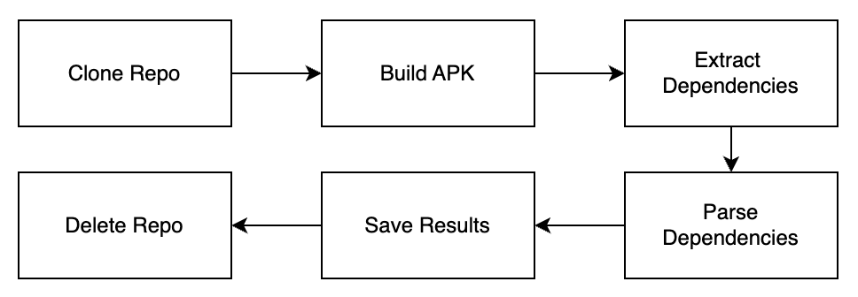

## Dependency Extraction

Dependency extraction on the filtered list of github links. Github links that 
were build within the environment. Once the repository is built then we extract the dependencies. 
The extracted dependencies were then parsed into a CSV, which was split into Group, Artifact and Version for each library 
and repository. 

