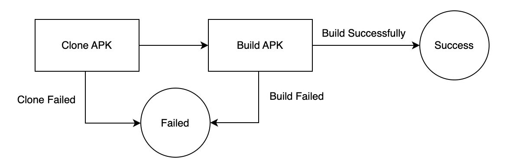

# Filtered Applications

Script for filtering applications, based on compilation in the configured environment. This script was run on almost 50 open 
source projects, and out 50 there were around 10 open source projects that were compiled. The script for dependencies and apk
size will now be run on those projects to get their details. Before that we need to modify the script to work on a list of 
github links. 

