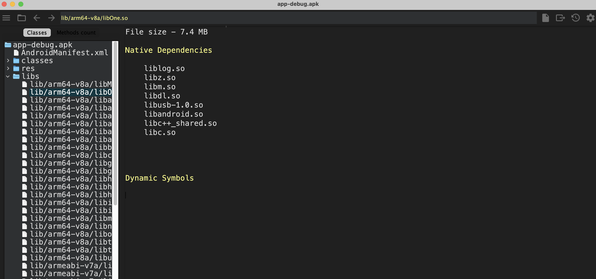
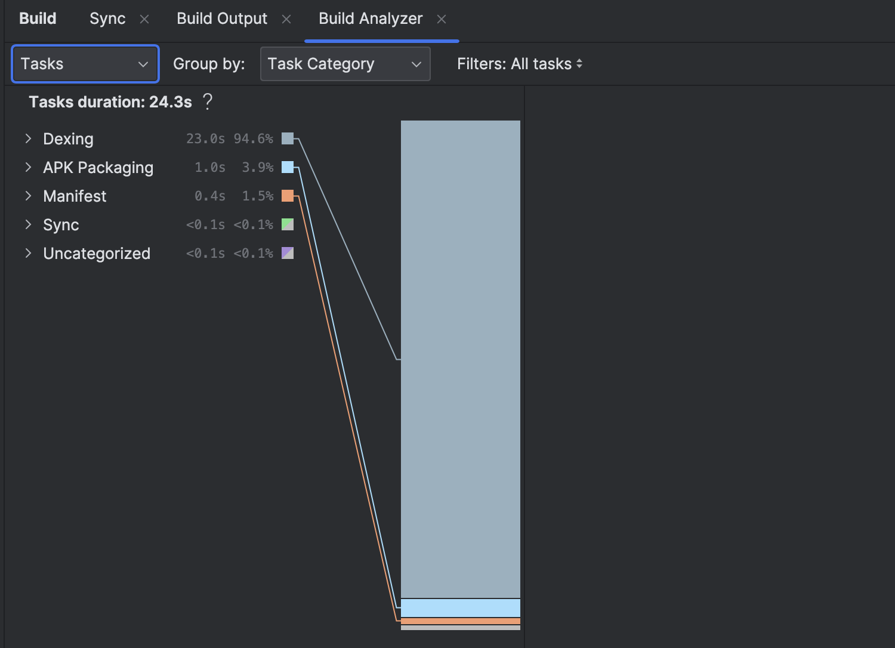

## Tools
- Dependabot https://github.com/dependabot
- Gradle Lint Plugin https://github.com/nebula-plugins/gradle-lint-plugin
- ClassyShark https://github.com/google/android-classyshark
- Build Analyser in Android Studio

#### Worked and installed Classy Shark
You can add APK or project files, it then analyses the dex files and libraries (needs to be un-obfuscated), this shows 
the size of library and each dex file, there is an extract button, but it seems to do nothing, if we 
can extract the files, we can maybe write an automation to build and send apk to ClassyShark and extract 
information for our analysis.

#### Build Analyser inside Android Studio
This shows the steps it took to compete commands and how much time it took to complete each step and 
what steps or tasks are impacting build performance 

